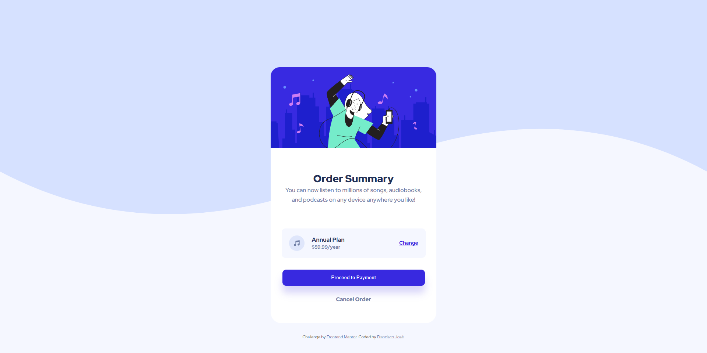
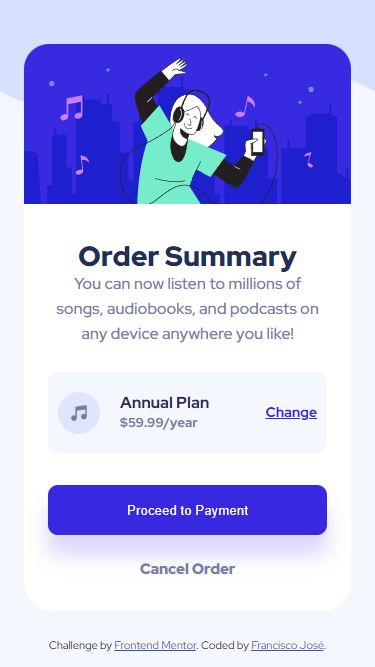

# Frontend Mentor - Order summary card solution

This is a solution to the [Order summary card challenge on Frontend Mentor](https://www.frontendmentor.io/challenges/order-summary-component-QlPmajDUj). Frontend Mentor challenges help you improve your coding skills by building realistic projects. 

## Table of contents

- [Overview](#overview)
  - [The challenge](#the-challenge)
  - [Screenshot](#screenshot)
  - [Links](#links)
- [My process](#my-process)
  - [Built with](#built-with)
  - [What I learned](#what-i-learned)
  - [Continued development](#continued-development)
  - [Useful resources](#useful-resources)
- [Author](#author)


## Overview

### The challenge

Users should be able to:

- See hover states for interactive elements 

### Screenshot





### Links

- Solution URL: [Add solution URL here](https://your-solution-url.com)
- Live Site URL: [Add live site URL here](https://your-live-site-url.com)

## My process

### Built with

- Semantic HTML5 markup
- CSS custom properties
- Flexbox
- CSS Grid
- Mobile-first workflow

### What I learned

In this project I've learned to work with Global Variables. I've placed all the colors this way thinking how a big project should work. That way It would be easier to change if someone decided to change the colors of the elements. Also I tried to work with **var()** and to make it calculate the exact size of the font. That way no matter the browser, the font will always show like I planned to.

```css
:root {
  --pale_blue: hsl(225, 100%, 94%);
  --bright_blue: hsl(245, 75%, 52%, 1);
  --very_pale_blue: hsl(225, 100%, 98%);
  --desaturated_blue: hsl(224, 23%, 55%);
  --dark_blue: hsl(223, 47%, 23%);
  --greyed_blue: hsl(245, 83%, 68%);
  --dark_font_color: hsla(223, 23%, 55%, 1);
  --font-size: 16px;
}

.info h1 {
  font-size: var((--font-size) * 1.5);
  color: var(--dark_blue);
}

```
I'm still get the haging of wortking with flexbox and placing the elements on the exact place of the design. Right now I'm kind of mixing flexbox and absolute positioning.


### Continued development

I've been studying **flexbox** and composing layouts for some time now. I'm finally getting the hang of it, but I still got a long way to go. So I'll keep studying and praticing on some projects to finally master it. 


### Useful resources

- [A Complete Guide to Flexbox
](https://css-tricks.com/snippets/css/a-guide-to-flexbox/) 
  - This helped me for the work better with flexbox and also understand how the parents and children elements work.

- [Color Converter
](https://www.w3schools.com/colors/colors_converter.asp) 
  - This site helped me figuring out the colors for some components. 


- [CSS variables](https://developer.mozilla.org/en-US/docs/Web/CSS/--*) 
  - The Mozilla documentation on variables and some examples. It's worth the reading.

## Author

- Frontend Mentor - [@fcoxico](https://www.frontendmentor.io/profile/fcoxico)
- Linkedin - [@franciscojcardoso/](https://www.linkedin.com/in/franciscojcardoso)